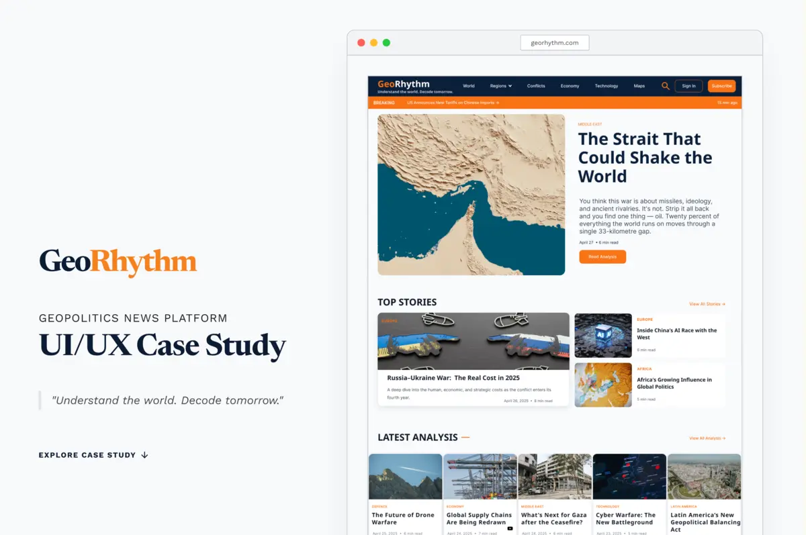

# Jeme — Product & UI/UX Designer Portfolio

<p align="center">
  
</p>

<p align="center">
  <strong>Crafting intuitive digital products, UX research frameworks, and scalable Figma design systems — powered by AI-accelerated frontend engineering.</strong>
</p>

<p align="center">
  <a href="https://nextjs.org"></a>
  <a href="https://react.dev"></a>
  <a href="https://www.typescriptlang.org"></a>
  <a href="https://tailwindcss.com"></a>
  <a href="https://www.framer.com/motion"></a>
</p>

---

## 🌟 Overview

This repository houses the personal portfolio and interactive design showcase of **Jeme (Jenish Logesh)** — a Product & UI/UX Designer who bridges the divide between design fidelity and code execution through AI-accelerated frontend workflows.

The site is engineered with **Next.js 16 (App Router)**, **React 19**, **Tailwind CSS**, and **Framer Motion**, featuring a cinematic cursor-scrubbed hero video, magnetic tactile interactions, and comprehensive long-form case studies.

---

## ✨ Key Features

### 🎬 Cinematic Cursor-Scrubbed Hero
- **Dual-Codec Hardware Acceleration**: Lightweight WebM prioritized with high-compatibility MP4 fallback.
- **Microsecond Cursor Scrubbing**: Delta-time mouse tracking mapped smoothly to video playback with seek-flooding prevention.
- **Editorial Typography Overlay**: Cormorant Garamond serif paired with Plus Jakarta Sans and Geist Mono.

### 📱 Deep UX Case Studies
- **Behance-Style Case Study Layout**: High-resolution, multi-section design showcases for:
  - **[GeoRythum](src/app/case-study/georythum/page.tsx)**: Distraction-free geopolitical & climate editorial knowledge platform.
  - **[GALO](src/app/case-study/galo/page.tsx)**: Privacy-first memory vault and time-locked capsule mobile application.
- **Reading Progress & Sticky Navigation**: Dynamic top progress bar, floating back-to-top button, and seamless case study switcher.

### ⚡ Dynamic Island Navigation
- **Floating Capsule Navbar**: Glassmorphism backdrop blur (`backdrop-blur-xl`), smart auto-hide on downward scroll, and instant reveal on upward scroll.
- **Active Section Spy**: Real-time observer updating navigation indicator as users navigate between *Hero*, *Works*, *About*, and *Contact*.
- **Responsive Mobile Drawer**: Fluid animated drawer for touch screens and mobile viewports.

### 🧲 Tactile Micro-Interactions & Physics
- **Magnetic Buttons**: Cursor-following spring physics (`Magnetic.tsx`) on primary CTAs and contact triggers.
- **Scroll Reveal System**: Coordinated entry transitions using Framer Motion.

### 🎨 Warm Obsidian Design System
- Custom color tokens inspired by dark studio aesthetics: `canvas`, `surface-glass`, `rim-glass`, `ember-red`, `warm-amber`, `copper-wire`.
- Distinct typography pairings: **Cormorant Garamond**, **Plus Jakarta Sans**, **Space Grotesk**, **PT Serif**, and **Geist Mono**.

### 🚀 SEO, Accessibility & Web Vitals
- Complete metadata suite with OpenGraph preview cards, Twitter cards, and structured JSON-LD.
- Next.js dynamic [`sitemap.ts`](src/app/sitemap.ts) and [`robots.ts`](src/app/robots.ts).
- Semantic HTML5 landmarks, ARIA labels, and `prefers-reduced-motion` compliance.

---

## 🛠️ Tech Stack

| Category | Technology |
|---|---|
| **Framework** | [Next.js 16.2.4](https://nextjs.org/) (App Router, Turbopack ready) |
| **UI Library** | [React 19.2.4](https://react.dev/) |
| **Language** | [TypeScript 5.0](https://www.typescriptlang.org/) |
| **Styling** | [Tailwind CSS v3.4](https://tailwindcss.com/) + PostCSS + Autoprefixer |
| **Motion & Animation** | [Framer Motion 12.38](https://www.framer.com/motion/) |
| **Typography** | `next/font/google` (Plus Jakarta Sans, Space Grotesk, Cormorant Garamond, PT Serif, Geist Mono) |
| **Code Quality** | ESLint 9 (`eslint-config-next`) |

---

## 📂 Project Structure

```
portfolio-master/
├── public/
│   ├── case-studies/           # High-resolution case study assets
│   ├── Resume/                 # PDF Resume & CV documents
│   ├── ME.png                  # Profile photograph
│   ├── Herosec.webm            # Primary video format
│   ├── Herosec.mp4             # Video fallback
│   ├── Herosec_poster.webp     # Instant video poster frame
│   ├── galo-preview.webp       # Project card preview images
│   └── georythum-preview.webp  # Project card preview images
├── src/
│   ├── app/
│   │   ├── case-study/
│   │   │   ├── galo/page.tsx       # GALO Case Study Route
│   │   │   └── georythum/page.tsx  # GeoRythum Case Study Route
│   │   ├── error.tsx               # Global error boundary
│   │   ├── globals.css             # Tailwind base styles, theme variables, & utilities
│   │   ├── layout.tsx              # Root HTML, SEO metadata, & global navbar
│   │   ├── not-found.tsx           # Custom 404 page
│   │   ├── page.tsx                # Homepage composition
│   │   ├── robots.ts               # Automated robots.txt generator
│   │   └── sitemap.ts              # Automated sitemap.xml generator
│   ├── components/
│   │   ├── case-study/
│   │   │   ├── CaseStudyLayout.tsx          # Case study template with lightbox & progress bar
│   │   │   └── case-study-layout.module.css # Case study layout styling
│   │   ├── layout/
│   │   │   ├── Footer.tsx          # Studio footer with contact triggers & socials
│   │   │   └── Navbar.tsx          # Floating dynamic island navbar & mobile menu
│   │   ├── sections/
│   │   │   ├── About.tsx           # Bento grid about section with 3 core pillars
│   │   │   ├── Contact.tsx         # Multi-channel direct contact matrix
│   │   │   ├── Hero.tsx            # Headline, quick actions, & cursor-scrubbed video
│   │   │   └── Projects.tsx        # Selected works index (grid & editorial views)
│   │   └── ui/
│   │       ├── Magnetic.tsx               # Magnetic cursor physics component
│   │       ├── ProjectCard.tsx            # Project showcase card
│   │       ├── ScrollReveal.tsx           # Framer motion view-trigger wrapper
│   │       └── SectionHeading.tsx         # Standardized numbered section header
│   ├── data/
│   │   └── portfolio.ts            # Single source of truth for projects, bio, & case studies
│   └── hooks/
│       └── useSmoothScroll.ts      # Smooth anchor scrolling utility
├── eslint.config.mjs               # ESLint configuration
├── next.config.ts                  # Next.js configuration
├── package.json                    # Dependencies & scripts
├── postcss.config.mjs              # PostCSS configuration
├── tailwind.config.ts              # Custom design tokens, colors, & typography config
└── tsconfig.json                   # TypeScript configuration
```

---

## 🚀 Getting Started

### Prerequisites
- **Node.js**: `v18.18.0` or later (Node 20+ recommended)
- **Package Manager**: `npm`, `pnpm`, `yarn`, or `bun`

### 1. Clone the Repository
```bash
git clone https://github.com/Jenish5039/portfolio.git
cd portfolio
```

### 2. Install Dependencies
```bash
npm install
# or
pnpm install
# or
yarn install
```

### 3. Start the Development Server
```bash
npm run dev
```

Open [http://localhost:3000](http://localhost:3000) in your browser to view the application with hot module reloading.

---

## 🛠️ Available Scripts

| Command | Description |
|---|---|
| `npm run dev` | Runs the Next.js development server on `localhost:3000` |
| `npm run build` | Builds an optimized production build |
| `npm run start` | Starts the production server |
| `npm run lint` | Runs ESLint checks across the codebase |

---

## ⚙️ Customization & Content Management

All profile data, projects, case studies, contact channels, and skills are managed through a **single source of truth**:

📂 **`src/data/portfolio.ts`**

### Modifying Content:
- **Personal Information**: Update `personalInfo`.
- **Featured Works**: Add or edit project objects in `projects`.
- **Case Study Pages**: Add detailed metadata, long-form infographic paths, and color themes in `caseStudies`.
- **Contact Channels**: Configure email, phone, and LinkedIn in `contactChannels` and `socialLinks`.

---

## 📬 Contact & Connect

- **Name**: Jeme (Jenish Logesh)
- **Role**: Product & UI/UX Designer · AI-Accelerated Frontend
- **Email**: [jenishlogesh@gmail.com](mailto:jenishlogesh@gmail.com)
- **LinkedIn**: [linkedin.com/in/jenish-m-b225171a9](https://linkedin.com/in/jenish-m-b225171a9)
- **Location**: Hosur, Tamil Nadu

---

## 📄 License

Created with precision by **Jeme**. All rights reserved.